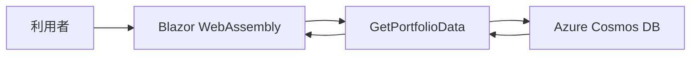
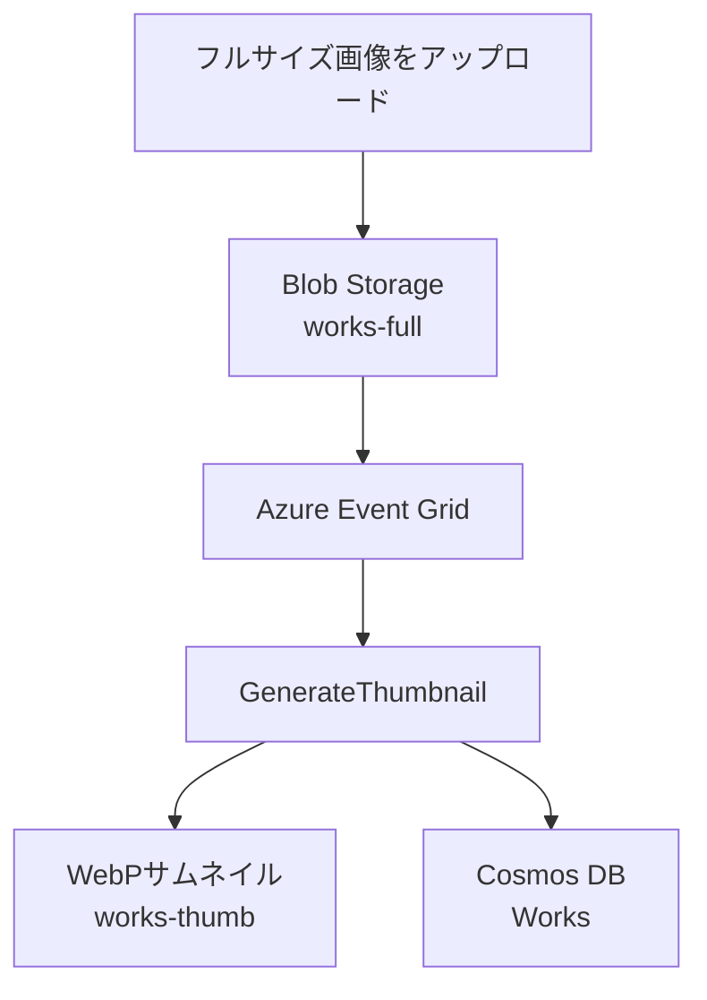

# PortfolioUtilityFunctions

Blazor WebAssembly製ポートフォリオサイトのバックエンドを担当するAzure Functionsアプリです。

Azure Cosmos DBに保存したプロフィール、スキル、職歴、制作物をフロントエンドへ提供するAPIと、Azure Blob Storageへの画像アップロードを起点としてWebPサムネイルの生成および制作物データの初期登録を行うイベント駆動処理を実装しています。

## 関連リンク

- [Blazorフロントエンドのリポジトリ](https://github.com/genkokudo/Portfolio)

## このアプリの役割

本アプリは、ポートフォリオシステムにおける次の処理を担当します。

- Azure Cosmos DBから公開用データを取得し、Blazor WebAssemblyへ返す
- Azure Blob Storageへの画像アップロードをEvent Grid経由で検知する
- アップロードされた画像から一覧表示用のWebPサムネイルを生成する
- フルサイズ画像とサムネイルのURLをAzure Cosmos DBへ初期登録する
- Application Insightsへ実行状況を送信する

## 主な関数

| 関数名 | トリガー | 認証レベル | 役割 |
| --- | --- | --- | --- |
| `GetPortfolioData` | HTTP GET | Anonymous | プロフィール、スキル、職歴、公開中の制作物を取得して一つのレスポンスへ集約する |
| `GenerateThumbnail` | Event Grid | Event Grid | `works-full`への画像登録を検知し、WebPサムネイルの生成と制作物データの初期登録を行う |
| `TestReadWorkItem` | HTTP GET | Anonymous | `Works`コンテナの読み込みを確認する開発用関数 |
| `TestRegisterWorkItem` | HTTP GET / POST | Function | テスト用の制作物データを登録する開発用関数 |

`GetPortfolioData`はブラウザ上で動作するBlazor WebAssemblyから呼び出すため、関数キーをクライアントへ保持させずAnonymousとしています。公開されても問題のないデータだけを返し、Azure Functions側のCORS設定で呼び出し元を制限する前提です。

> [!NOTE]
> CORSは認証機能ではなく、ブラウザからのクロスオリジン通信を制御する仕組みです。機密情報を返す処理には、別途適切な認証・認可が必要です。

## システム構成

### データ取得

Blazor WebAssemblyは`GetPortfolioData`を呼び出し、画面表示に必要なデータをまとめて取得します。API側でAzure Cosmos DBへの問い合わせを集約することで、フロントエンドがデータベースの構造や接続情報を持たない構成にしています。



`GetPortfolioData`は次のデータを取得します。

- `Profile`：プロフィール、肩書、自己紹介、GitHub URLなど
- `Skills`：表示順に並べた保有スキル
- `WorkHistory`：表示順に並べた職歴と担当プロジェクト
- `Works`：`isPublished = true`の公開中制作物

### 画像登録とサムネイル生成

フルサイズ画像を`works-full`コンテナへアップロードすると、Azure StorageのBlob作成イベントがEvent Grid経由で`GenerateThumbnail`へ通知されます。



処理の流れは次のとおりです。

1. `Microsoft.Storage.BlobCreated`イベントであることを確認する
2. イベントの対象が`works-full`コンテナであることを確認する
3. Blob Storageから元画像を読み込む
4. 画像の縦横比に応じたサイズへ縮小する
5. WebP形式へ変換して`works-thumb`へ保存する
6. 元画像とサムネイルのURLを含む`WorkItem`を`Works`コンテナへ登録する

フルサイズ画像とサムネイルを別コンテナに保存することで、生成されたサムネイルによって同じ関数が再帰的に実行されることを防止しています。

## 画像処理の仕様

| 対象 | 判定 | 最大サイズ | 出力形式 |
| --- | --- | --- | --- |
| バナー | 元画像が正方形 | 280 × 280 px | WebP（Lossy、品質80） |
| フライヤー | 元画像が正方形以外 | 248 × 350 px | WebP（Lossy、品質80） |

リサイズには`ResizeMode.Max`を使用し、元画像のアスペクト比を維持したまま指定範囲へ収めます。

同名のサムネイルが既に存在する場合は、意図しない上書きやファイル名の衝突を防ぐため、例外を発生させて処理を中断します。

Azure Cosmos DBへ初期登録する制作物は`IsPublished = false`とし、タイトル、説明、カテゴリなどを編集した後に公開できるようにしています。

## 技術構成

| 分類 | 技術 | 用途 |
| --- | --- | --- |
| 言語・ランタイム | C# / .NET 10 | Functionsアプリの実装 |
| 実行基盤 | Azure Functions v4 Isolated Worker | HTTP APIとイベント駆動処理の実行 |
| データベース | Azure Cosmos DB | プロフィール、スキル、職歴、制作物の管理 |
| ストレージ | Azure Blob Storage | フルサイズ画像とサムネイルの保存 |
| イベント連携 | Azure Event Grid | Blob作成イベントの通知 |
| 画像処理 | SixLabors.ImageSharp | リサイズとWebP変換 |
| シリアライズ | Newtonsoft.Json / Azure Cosmos DB SDK | Event Gridデータの解析とCosmos DBとのデータ変換 |
| 監視 | Application Insights | 実行ログとテレメトリの収集 |
| CI/CD | GitHub Actions | Azure Functionsへの自動デプロイ |

フロントエンドとFunctionsで同じデータ構造を使用するため、共通モデルを`Portfolio.Shared`で管理しています。本リポジトリではビルド済みアセンブリを`libs/Portfolio.Shared.dll`から参照します。

## データストア

コードは、Azure Cosmos DBに次のデータベースとコンテナが存在することを前提としています。

- データベース：`PortfolioDB`

| コンテナ | 主な用途 | コード上のパーティション値・条件 |
| --- | --- | --- |
| `Profile` | プロフィール | IDおよびパーティション値：`profile` |
| `Skills` | 保有スキル | `partitionKey = "skill"`、`sortOrder`順 |
| `WorkHistory` | 職歴 | `partitionKey = "workHistory"`、`sortOrder`順 |
| `Works` | 制作物 | パーティションキー：`/id`、公開時は`isPublished = true` |

Azure Blob Storageでは次のコンテナを使用します。

| コンテナ | 用途 |
| --- | --- |
| `works-full` | フルサイズの元画像 |
| `works-thumb` | 自動生成したWebPサムネイル |

## プロジェクト構成

```text
PortfolioUtilityFunctions/
├── .github/
│   └── workflows/
│       └── master_portfolioutilityfunctions.yml
├── PortfolioUtilityFunctions/
│   ├── GenerateData.cs
│   ├── GetPortfolioData.cs
│   ├── Program.cs
│   ├── host.json
│   ├── PortfolioUtilityFunctions.csproj
│   ├── libs/
│   │   └── Portfolio.Shared.dll
│   └── Properties/
├── PortfolioUtilityFunctions.slnx
├── LICENSE.txt
└── README.md
```

## ローカル開発

### 必要環境

- .NET 10 SDK
- Azure Functions Core Tools v4
- Azurite
- Azure Cosmos DBまたはAzure Cosmos DB Emulator
- Azure Storage Explorer（Blobの確認に使用、任意）

### ローカル設定

`PortfolioUtilityFunctions`プロジェクトのディレクトリに、Gitの管理対象外となる`local.settings.json`を作成します。

```json
{
  "IsEncrypted": false,
  "Values": {
    "AzureWebJobsStorage": "UseDevelopmentStorage=true",
    "FUNCTIONS_WORKER_RUNTIME": "dotnet-isolated",
    "StorageConnection": "UseDevelopmentStorage=true",
    "CosmosDB__ConnectionString": "<Cosmos DBの接続文字列>"
  }
}
```

| 設定名 | 用途 |
| --- | --- |
| `AzureWebJobsStorage` | Azure Functionsランタイムが使用するストレージ接続 |
| `FUNCTIONS_WORKER_RUNTIME` | .NET Isolated Workerの指定 |
| `StorageConnection` | 制作物画像を保存するBlob Storageへの接続 |
| `CosmosDB__ConnectionString` | Azure Cosmos DBへの接続 |

接続文字列やキーなどの秘密情報は、リポジトリへコミットしないでください。本番環境ではAzure Function Appのアプリケーション設定で管理します。

### 事前準備

1. Azuriteを起動する
2. Blob Storageに`works-full`と`works-thumb`コンテナを作成する
3. Azure Cosmos DBに`PortfolioDB`データベースと必要なコンテナを作成する
4. `local.settings.json`へ接続情報を設定する

### ビルドと起動

リポジトリのルートで次のコマンドを実行します。

```bash
dotnet restore
dotnet build
dotnet run --project PortfolioUtilityFunctions/PortfolioUtilityFunctions.csproj
```

Visual Studioから`PortfolioUtilityFunctions`プロジェクトを起動する場合、HTTPポートは`7048`に設定されています。

### サムネイル生成の確認

1. Functionsアプリを起動する
2. Azure Storage Explorerなどから`works-full`へ画像をアップロードする
3. `works-thumb`にWebPサムネイルが生成されたことを確認する
4. Azure Cosmos DBの`Works`コンテナに`IsPublished = false`のデータが登録されたことを確認する

ローカル環境でEvent Grid経由の処理を再現する場合は、Event GridイベントをFunctionsへ送信できる構成が別途必要です。本番環境では、ストレージアカウントのBlob作成イベントをFunction Appへ通知するEvent Gridサブスクリプションを設定します。

## 設計・実装上の工夫

### 閲覧処理と画像登録処理の分離

画面表示用のHTTP APIと、管理時にだけ実行される画像処理を別の関数として実装しています。閲覧処理の応答性と画像処理の負荷を分離し、それぞれを独立して変更できる構成です。

### Event Gridによるイベント駆動処理

本番環境での通知遅延と信頼性を考慮し、Blobのポーリングを前提とする処理ではなく、Azure Event Gridから通知を受け取る構成を採用しました。関数はイベントに含まれるBlobの場所を解析し、必要な画像だけを取得して処理します。

### 公開前提の初期データ登録

画像アップロード時にはURLなどの最低限の情報だけを登録し、`IsPublished = false`とします。掲載内容を整える前の制作物が、ポートフォリオサイトへ誤って表示されないようにしています。

### ファイル名衝突の検知

同名サムネイルが存在する場合に上書きせず、処理を中断します。意図しない画像の差し替えや、元画像とデータの対応関係が崩れることを防ぎます。

### 共通モデルによるデータ構造の統一

BlazorフロントエンドとFunctionsで共通モデルを使用し、APIの送受信データとAzure Cosmos DBのドキュメント構造の不一致を抑えています。

## CI/CD

`master`ブランチへのPush、または手動実行を契機としてGitHub Actionsが起動します。

1. .NET 10環境をセットアップする
2. Release構成でプロジェクトをビルドする
3. OpenID Connect（OIDC）でAzureへログインする
4. ビルド結果を`PortfolioUtilityFunctions` Function AppのProductionスロットへデプロイする

Azureへの認証情報はGitHub Secretsで管理し、ワークフロー内へ直接記述しません。

## 開発用関数について

`TestReadWorkItem`と`TestRegisterWorkItem`は、Azure Cosmos DBとの接続やデータ操作を確認するための開発用関数です。本番環境で不要な場合は、デプロイ対象から除外するか、十分な認証・認可を設定してください。

特に`TestReadWorkItem`は現在Anonymousであり、`Works`コンテナの全データを返します。本番公開時は削除または認証レベルの変更が必要です。

## ライセンス

このプロジェクトは[MIT License](LICENSE.txt)のもとで公開されています。
